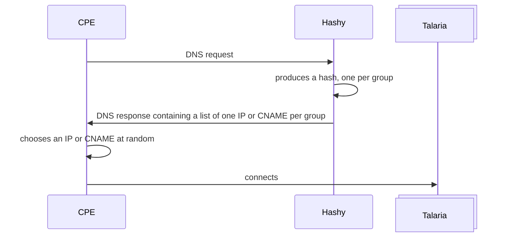
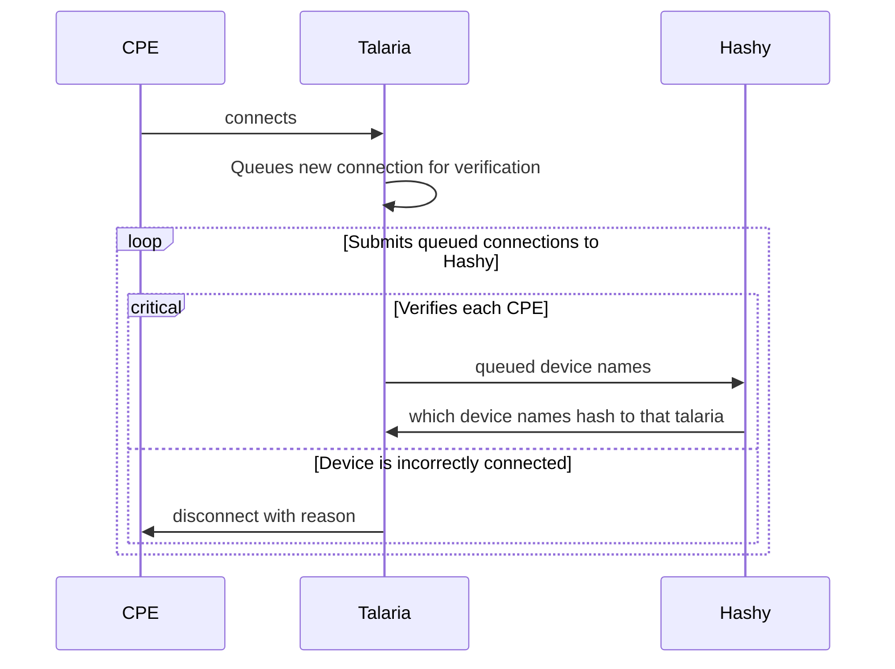
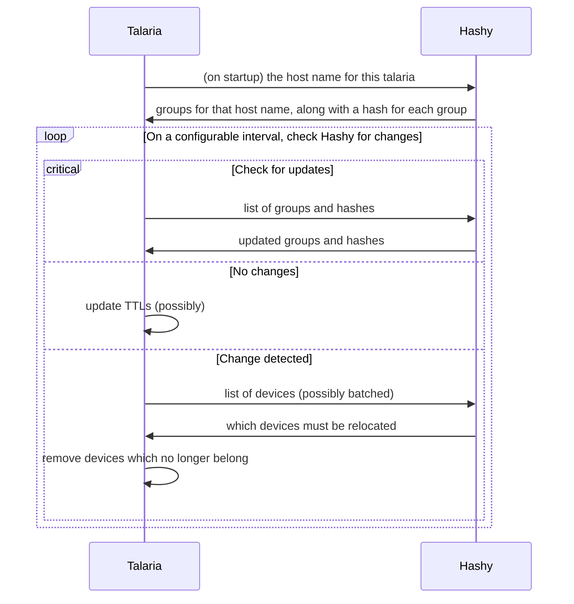

# Hashy Design

## Key Features

- Accepts DNS requests for devices
  - Host name is synthetic and contains the device name (e.g. MAC)
- Provides a RESTful interface that allows checking for updates
  - Hashy's [groups](#groups) can be updated dynamically
- Static configuration of groups
  - A group is a list of host names (i.e. talaria servers)

## Concepts

### DNS for devices

Hashy's DNS server understands hostnames with the following form:

```text
{deviceName}[-{ignored text}].{subdomain}
```

#### {deviceName}

The `deviceName` is the string that is hashed. It can only contain characters that are valid for a hostname. The meaning of the `deviceName` is opaque to Hashy. It can be a MAC address, UUID, or any arbitrary identifier. The list of servers returned via DNS is solely determined by the `deviceName`.

#### {ignored text}

Anything that comes after the `deviceName`, separated by a hyphen (`-`), is ignored. This allows devices to incorporate nonce values or other information for debugging and to ensure hostnames are not cached by intermediaries.

#### {subdomain}

The `subdomain` is a domain that Hashy will respond to. Hashy can respond to any of a list of subdomains, set via configuration.

Hashy will act as the SOA for configured subdomains. Any requests that don't match a configured subdomain results in an unknown response.

### Groups

Hashy organizes servers into `groups`. A *group* is simply *a list of servers with a unique name*. A group can be a datacenter, but it can also be any arbitrary list of servers. A server may belong to multiple groups. Groups are supplied to Hashy via configuration or (TODO) dynamically at runtime.

Hashy computes a hash of each group so that clients can determine if a group's members have changed.

## Flows

### CPE uses Hashy (instead of Petasos) to find a Talaria



### Talaria checks devices upon connection



### Talaria enforces device hashing


