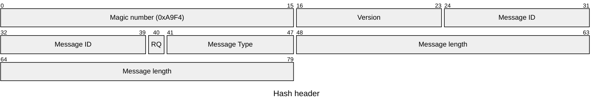

# hashy

hashy is a distribute hashing-as-a-service server. It uses the results of hashing to direct traffic.

## Summary

Summary should be a small paragraph explanation of what this project does.

## Table of Contents

- [Code of Conduct](#code-of-conduct)
- [Hash Protocol](#hash-protocol)
- [Install](#install)
- [Contributing](#contributing)

## Code of Conduct

This project and everyone participating in it are governed by the [XMiDT Code Of Conduct](https://xmidt.io/docs/community/code_of_conduct/). 
By participating, you agree to this Code.

## Hash Protocol

`hashy` provides a low-level protocol for hashing multiple objects at once and checking which objects hash to a subject. All integral values are big-endian.

### Header

#### Magic Number

All hash messages are prefixed with the 16-bit value **0xA9F4**.

#### Version

Version holds the 8-bit protocol version. The initial version is **1**.

#### Message ID

A client can set a 16-bit identifier to uniquely identify a message. `hashy` will place this same identifier into the response message.

#### RQ bit

A single bit indicates whether this is a request or response.  **0** is used for request, **1** for response.

#### Message Type

Message types are 7-bit values that indicate the purpose and layout of the message.

| Value | Message | Description |
| --- | --- | --- |
| 0000000 | Check | Request contains a subject and multiple objects. Response contains a list of objects that still hash to that subject and ones that do not. |

#### Message Length

A 32-bit length integer concludes the header and specifies how many message bytes follow.

## Install

Add details here.

## Contributing

Refer to [CONTRIBUTING.md](CONTRIBUTING.md).
